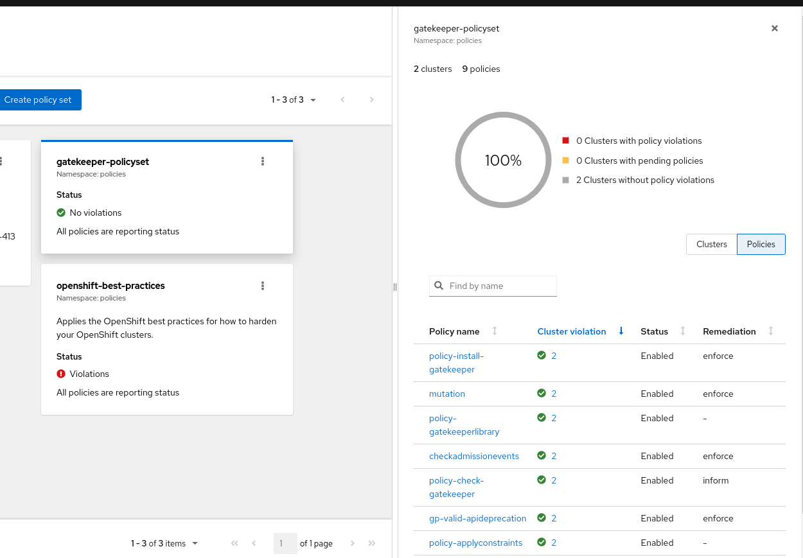

## Setting Up RHACM-Policies with ArgoCD for OpenShift Best Practices and Gatekeeper

Welcome to this `tutorial` on configuring ArgoCD to deploy Policies for OpenShift best practices and Gatekeeper using Red Hat Advanced Cluster Management (RHACM).

In this guide, we'll walk you through the steps to set up and manage policies efficiently. 

Those `PolicySets` will help you configure OpenShift for best practices, enhancing security and ensuring compliance. Argo CD, a popular GitOps tool, is the perfect choice for managing policies in a Kubernetes environment.

The entire setup will take just a few minutes, so let's get started!

## Prerequisites

Before we dive into the tutorial, make sure you have the following prerequisites in place:

1. Kubeadmin access to a OpenShift Cluster with RHACM 2.9 installed.
2. `kubectl` and `oc` command-line tools installed.
3. download this repository and execute the provided script 
## Setup

To simplify the setup process, we've provided a script that automates the deployment of necessary Kubernetes resources for you. Here's how you can set up ArgoCD for deploying Policies:

1. Create a new file named `setup-argocd.sh` and paste the provided script into it.

```bash
#!/bin/bash

# List of Kubernetes files to apply
files=(
    "01_namespaces.yaml"
    "02_managedclustersetbinding.yaml"
    "03_installoperator.yaml"
    "04_argocd.yaml"
    "05_appproject.yaml"
    "06_applications.yaml"
    "07_placement.yaml"
)

# Function to apply a file with retries (especially we need to wait till GitopsOperator is installed)
apply_with_retry() {
    local file="$1"
    local retries=3
    local interval=10

    for ((i=0; i<retries; i++)); do
        echo "Applying $file (Attempt $((i+1)))"
        oc apply -f "$file"
        if [ $? -eq 0 ]; then
            echo "$file applied successfully"
            return 0
        else
            echo "Error applying $file. Retrying in $interval seconds..."
            sleep $interval
        fi
    done

    echo "Failed to apply $file after $retries attempts"
    return 1
}

# Iterate over the files and apply them with retries
for file in "${files[@]}"; do
    apply_with_retry "$file" || exit 1
done

echo "All files applied successfully"
```

2. Save the file and make it executable by running:

```bash
chmod +x setup-argocd.sh
```

3. Execute the script to set up ArgoCD and deploy the Policies:

```bash
./setup-argocd.sh
```

## Understanding the YAML Files

Now, let's briefly explain the contents of the YAML files provided in the script:

1. `01_namespaces.yaml`: Defines two namespaces, `policies` and `openshift-gitops`.

2. `02_managedclustersetbinding.yaml`: Binds a ManagedClusterSet to the `policies` namespace.

3. `03_installoperator.yaml`: Installs the OpenShift GitOps Operator in the `openshift-gitops` namespace.

4. `04_argocd.yaml`: Defines the ArgoCD configuration in the `policies` namespace.

#Note :

Ensure that you use the recent version of PolicyGenerator (so upgrade those lines e.g. v2.9.0 if you update RHACM)

```
    initContainers:
    - args:
      - cp /etc/kustomize/plugin/policy.open-cluster-management.io/v1/policygenerator/PolicyGenerator
        /policy-generator/PolicyGenerator
      command:
      - sh
      - -c
      image: registry.redhat.io/rhacm2/multicluster-operators-subscription-rhel8:v2.9.0
      name: policy-generator-install
      volumeMounts:
      - mountPath: /policy-generator
        name: policy-generator
```

5. `05_appproject.yaml`: Configures an ArgoCD application for deploying the PolicySet, pointing to the `ocp-best-practices-policyset`.

Here you could also make some custom rbac-setting like excluding certain objects or enforce manual sync.....


6. `06_applications.yaml`: Sets up an ArgoCD application project.

7. `07_placement.yaml`: Defines placement-definitions for the Policies.

At the end of the setup, you'll find the deployed policies in the RHACM Governance UI.




## Tutorial: Deploying ACM Gatekeeper Integration with ArgoCD

Welcome to the second part of our tutorial series! In this tutorial, we will walk you through the process of creating a new application to deploy ACM Gatekeeper-Operator, Gatekeeper-Constraints, and Constraint Templates. We will also demonstrate the integration with ArgoCD.

## Prerequisites

Before we begin, please make sure you have completed the setup-gitops folder as a prerequisite. This step is crucial for setting up the environment correctly.

## Overview

In this tutorial, we will perform the following tasks:

1. Create an ArgoCD Instance on the Hub-Cluster in a namespace called 'policies.'
2. Create ACM-Policies that wrap Gatekeeper Policies, establishing a link between ACM and Gatekeeper.
3. Demonstrate various features, including:
   - Dependency between policies.
   - Installation of Gatekeeper.
   - Configuration of Gatekeeper instances and exclusion of namespaces.
   - Verification of Gatekeeper's operational status.
   - Installation of the Gatekeeper library.
   - Installation of Custom Constraint Templates.
   - Installation of a Custom Constraints.
   - checks depending on the Kubernetes-Version
   - Policies to monitor also Admission-Events
   - Placement of Gatekeeper files distributed to clusters with specific labels. Gatekeeper Operator and Constraints will be installed on ManagedClusters with the label 'gatekeeper=true.'

## Central Configuration

All of the configurations discussed in this tutorial are managed though PolicyGenerator. You can find all the options it provides this file at the following URL:

[Policy Generator Plugin Configuration](https://github.com/stolostron/policy-generator-plugin/blob/main/docs/policygenerator-reference.yaml)

## InformGatekeeperPolicies

One important aspect to note is the `informGatekeeperPolicies` setting. When set to `true`, the policy expander will wrap everything in ConfigurationPolicies. Otherwise, it will leave it as a Gatekeeper manifest.

Now, let's dive into the step-by-step instructions for deploying ACM Gatekeeper Integration with ArgoCD:


To setup the tutorial just execute the folowing files again the RHACM 2.9 Hub-Cluster

```
oc apply -f files/tutorial2/01_applications.yaml
```

Gatekeeper setup will only be applied to Managed-Clusters with a certain label
(modify it to your needs)

```
        matchExpressions:
          - {key: gatekeeper, operator: In, values: ["true"]}
```

```
oc apply -f files/tutorial2/02_gatekeeper-placement.yaml
```

## Example of a Gatekeeper Check

See a Deployment which failed because of various checks

The first check failed because of wrong replicas number:  

```
apiVersion: apps/v1
kind: Deployment
metadata:
  name: book-import
  namespace: remote
  annotations:
    deployment.kubernetes.io/revision: "1"
    kubectl.kubernetes.io/last-applied-configuration: >
      {"apiVersion":"apps/v1","kind":"Deployment","metadata":{"annotations":{},"labels":{"app.kubernetes.io/instance":"pull-model-cstarkspoke1","name":"book-import"},"name":"book-import","namespace":"remote"},"spec":{"replicas":3,"selector":{"matchLabels":{"name":"book-import"}},"template":{"metadata":{"labels":{"name":"book-import"}},"spec":{"containers":[{"image":"quay.io/jpacker/hugo-nginx:latest","name":"book-import","ports":[{"containerPort":8080,"name":"http-server"}]}]}}}}
  creationTimestamp: 2023-12-19T10:36:32Z
  generation: 1
  labels:
    name: book-import
    app.kubernetes.io/instance: pull-model-cstarkspoke1
  managedFields:
  resourceVersion: "832379"
  uid: 164c016a-4572-4743-9e4b-2e4882380fa3
spec:
  progressDeadlineSeconds: 600
  replicas: 3
  revisionHistoryLimit: 10
  selector:
    matchLabels:
      name: book-import
  strategy:
    rollingUpdate:
      maxSurge: 25%
      maxUnavailable: 25%
    type: RollingUpdate
  template:
    metadata:
      creationTimestamp:
      labels:
        name: book-import
    spec:
      containers:
        - name: book-import
          image: quay.io/jpacker/hugo-nginx:latest
          imagePullPolicy: Always
          ports:
            - name: http-server
              containerPort: 8080
              protocol: TCP
          resources: {}
          terminationMessagePath: /dev/termination-log
          terminationMessagePolicy: File
      dnsPolicy: ClusterFirst
      restartPolicy: Always
      schedulerName: default-scheduler
      securityContext: {}
      terminationGracePeriodSeconds: 30
status:
  conditions:
    - lastTransitionTime: 2023-12-19T10:36:32Z
      lastUpdateTime: 2023-12-19T10:36:32Z
      message: Created new replica set "book-import-b67d9f7dc"
      reason: NewReplicaSetCreated
      status: "True"
      type: Progressing
      reason: MinimumReplicasUnavailable
      status: "False"
      type: Available
    - lastTransitionTime: 2023-12-19T10:36:32Z
      lastUpdateTime: 2023-12-19T10:36:32Z
      message: >-
        admission webhook "validation.gatekeeper.sh" denied the request:
        [psp-automount-serviceaccount-token-pod] Automounting service account
        token is disallowed, pod: book-import-b67d9f7dc-m2m6l
        [container-ephemeral-storage-limit] container <book-import> has no resource limits
        [container-must-meet-ratio] container <book-import> has no resource limits
        [container-must-meet-ratio] container <book-import> has no resource requests
        [container-must-have-requests] container <book-import> has no resource requests
      reason: FailedCreate
      status: "True"
      type: ReplicaFailure
  observedGeneration: 1
  unavailableReplicas: 3
```

See a deployment which passes the checks:

```
apiVersion: apps/v1
kind: Deployment
metadata:
  labels:
    name: book-import
  name: book-import
spec:
  replicas: 3
  selector:
    matchLabels:
      name: book-import
  template:
    metadata:
      labels:
        name: book-import
    spec:
      automountServiceAccountToken: false
      containers:
      - image: quay.io/jpacker/hugo-nginx:latest
        name: book-import
        ports:
        - containerPort: 8080
          name: http-server
        resources:
          requests:
            cpu: "200m"
            memory: "1Gi"
          limits:
            cpu: "400m"
            memory: "2Gi"
            ephemeral-storage: "100Mi"
```


## Conclusion

By following these steps, you will successfully deploy ACM Gatekeeper Integration with ArgoCD. This integration allows you to manage policies effectively and ensure the compliance of your Kubernetes clusters

By deploying the two PolicySets you get a very elegant way to setup Compliance-As-Code and can focus now on making further modifications which match 
your goals.

From our experience we know that sometimes the `Why shall I do this` and `What goals can I achieve` and not 100% clear, reach out to us for any deeper discussion.


